# AIGC Video Platform - Complete User Guide

> Multi-account social media video publishing platform with AdsPower integration.

---

## Table of Contents

1. [Platform Overview](#1-platform-overview)
2. [Getting Started](#2-getting-started)
3. [Step 1: Server Setup (服务器)](#3-step-1-server-setup-服务器)
4. [Step 2: Device Sync (设备)](#4-step-2-device-sync-设备)
5. [Step 3: Upload Videos (视频)](#5-step-3-upload-videos-视频)
6. [Step 4: Data Scraping (数据采集)](#6-step-4-data-scraping-数据采集)
7. [Step 5: Product Management (商品)](#7-step-5-product-management-商品)
8. [Step 6: AI Content Generation (文案生成)](#8-step-6-ai-content-generation-文案生成)
9. [Step 7: Batch Publishing (发布)](#9-step-7-batch-publishing-发布)
10. [Step 8: Smart Scheduling (智能排期)](#10-step-8-smart-scheduling-智能排期)
11. [Step 9: Auto Pipeline (自动流水线)](#11-step-9-auto-pipeline-自动流水线)
12. [Step 10: Template Library (模板库)](#12-step-10-template-library-模板库)
13. [Step 11: Analytics (数据分析)](#13-step-11-analytics-数据分析)
14. [Step 12: Account Health (账号健康)](#14-step-12-account-health-账号健康)
15. [Troubleshooting](#15-troubleshooting)

---

## 1. Platform Overview

The AIGC Video Platform is a local-first web application for automating multi-account social media video publishing through **AdsPower** anti-detect browser profiles.

### Key Capabilities

- **Multi-account publishing**: Publish videos across multiple social media accounts simultaneously
- **AI content generation**: Automatically generate captions, hashtags, descriptions, and video scripts using Claude AI
- **Product scraping**: Scrape product info from TikTok Shop and other e-commerce platforms
- **AI video generation**: Generate short videos using Veo 3 via kie.ai
- **Smart scheduling**: Schedule posts at optimal times with a visual calendar
- **Pipeline automation**: One-click workflow from product selection to video publishing
- **Health monitoring**: Track account health scores and publishing success rates

### Dashboard (控制台)

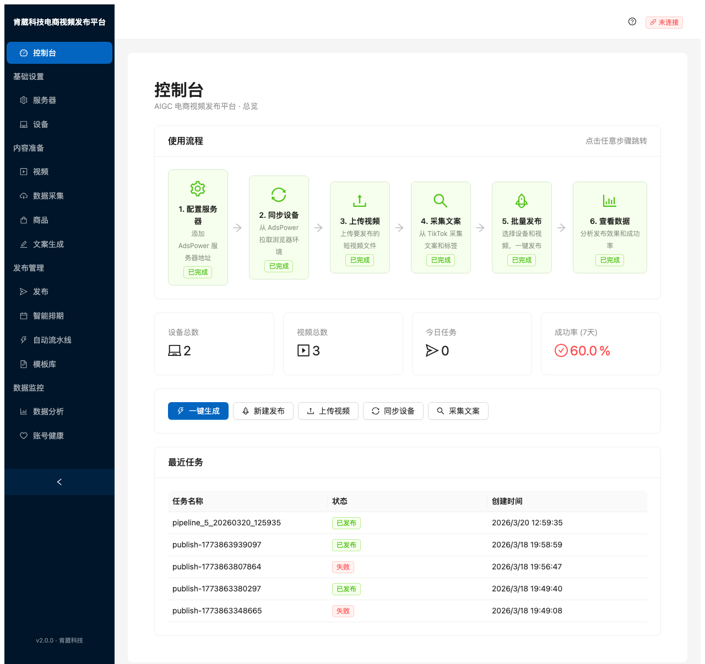

The dashboard provides a complete overview of your platform:

- **Workflow Guide** (使用流程): A 6-step visual guide showing which steps are completed. Click any step to jump to that page.
- **Summary Cards**: Shows total devices (设备总数), total videos (视频总数), today's tasks (今日任务), and 7-day success rate (成功率).
- **Quick Actions**: Shortcut buttons for common tasks — one-click generate (一键生成), new publish (新建发布), upload video (上传视频), sync devices (同步设备), scrape content (采集文案).
- **Recent Tasks** (最近任务): A table showing your most recent publishing tasks with status (已发布 = published, 失败 = failed).

> **Things to watch out for:**
> - The connection status indicator in the top-right shows whether the backend WebSocket is connected (已连接) or disconnected (未连接). If disconnected, real-time task updates will not appear.
> - The success rate is calculated over the last 7 days of publishing tasks.

---

## 2. Getting Started

### Prerequisites

1. **AdsPower** anti-detect browser installed and running on your machine
2. **Python 3.11+** for the backend
3. **Node.js 18+** for the frontend

### Starting the Application

```bash
# Start backend (port 8000)
cd backend
source venv/bin/activate   # or .venv/bin/activate
uvicorn app.main:app --reload --port 8000

# Start frontend (port 5173) — in a separate terminal
cd frontend
npm run dev
```

Then open **http://localhost:5173** in your browser.

### Recommended Workflow Order

Follow the sidebar groups in order:

1. **基础设置** (Basic Setup): Add servers → Sync devices
2. **内容准备** (Content Preparation): Upload videos → Scrape data → Manage products → Generate content
3. **发布管理** (Publish Management): Publish → Schedule → Pipeline → Templates
4. **数据监控** (Data Monitoring): Analytics → Account health

---

## 3. Step 1: Server Setup (服务器)

> **Sidebar**: 基础设置 → 服务器

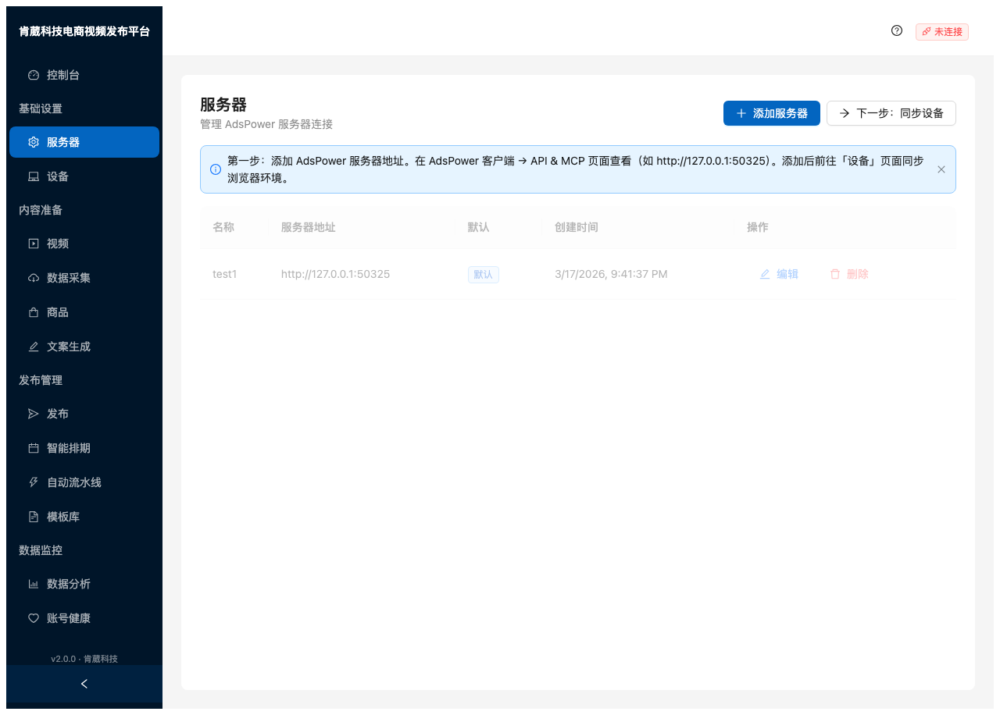

### What This Page Does

Manages connections to your **AdsPower** instances. Each AdsPower installation runs a local API server that this platform communicates with to control browser profiles.

### Inputs

| Field | Description | Example |
|-------|-------------|---------|
| **名称** (Name) | A friendly name for this server | `My AdsPower` |
| **服务器地址** (Server URL) | The AdsPower API endpoint | `http://127.0.0.1:50325` |

### How to Find Your AdsPower URL

1. Open AdsPower desktop application
2. Go to **API & MCP** settings page
3. Copy the local API address (usually `http://127.0.0.1:50325`)

### Actions

- **添加服务器** (Add Server): Opens a modal to enter server name and URL
- **下一步：同步设备** (Next: Sync Devices): Navigates to the device page after adding a server
- **编辑** (Edit): Modify server name or URL
- **删除** (Delete): Remove the server and all associated device profiles

### Outputs

A table showing all configured servers with their name, URL, default status, and creation time.

> **Things to watch out for:**
> - The first server added automatically becomes the **default** (默认). The default server is used when no server is explicitly selected elsewhere.
> - Make sure AdsPower is running before adding a server, otherwise sync will fail.
> - Deleting a server will cascade-delete all synced device profiles under it.
> - The URL must include the port number (e.g., `:50325`).

---

## 4. Step 2: Device Sync (设备)

> **Sidebar**: 基础设置 → 设备

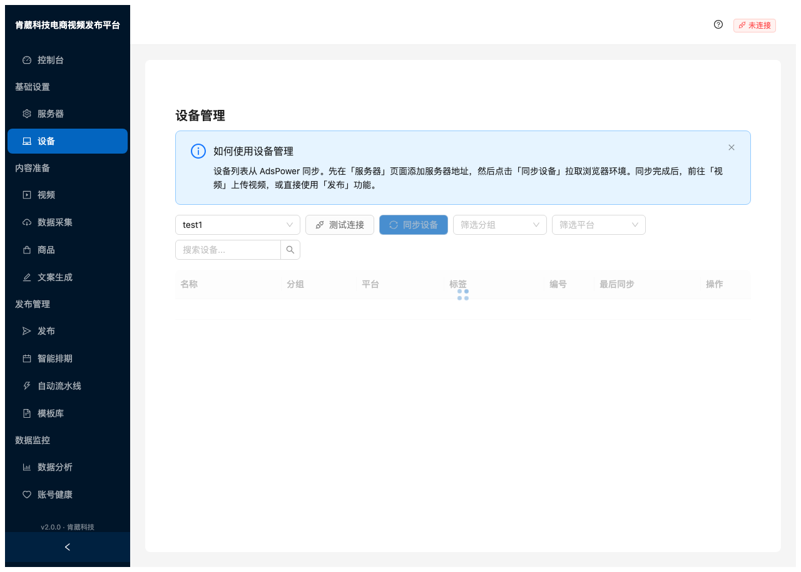

### What This Page Does

Synchronizes and manages **browser profiles** (devices) from AdsPower. Each profile represents an isolated browser environment typically linked to one social media account.

### How to Sync

1. Select a server from the dropdown (defaults to your default server)
2. Click **同步设备** (Sync Devices) — this pulls all browser profiles from the AdsPower API
3. Wait for the sync to complete (a few seconds depending on profile count)

### Actions

- **测试连接** (Test Connection): Verifies the server is reachable
- **同步设备** (Sync Devices): Fetches all profiles from AdsPower
- **筛选分组** (Filter by Group): Filter profiles by their AdsPower group
- **筛选平台** (Filter by Platform): Filter by social media platform
- **搜索设备** (Search): Search profiles by name

### Table Columns

| Column | Description |
|--------|-------------|
| **名称** (Name) | Profile name from AdsPower |
| **分组** (Group) | The group this profile belongs to in AdsPower |
| **平台** (Platform) | Social media platform tag |
| **标签** (Tags) | Custom tags for organizing profiles |
| **编号** (Serial Number) | AdsPower serial number |
| **最后同步** (Last Synced) | When this profile was last synced |

> **Things to watch out for:**
> - **Ungrouped profiles** (未分组) in AdsPower will also be synced. They appear with no group name.
> - Sync includes a **rate limit delay** (1.5 seconds between group fetches) to avoid overloading the AdsPower API. Large accounts may take 10-20 seconds.
> - If sync fails with a "Too many requests" error, wait a few seconds and try again.
> - Profiles are **not** automatically re-synced. You must click "同步设备" manually to update.
> - Tags and platform labels can be edited per-profile for organization purposes.

---

## 5. Step 3: Upload Videos (视频)

> **Sidebar**: 内容准备 → 视频

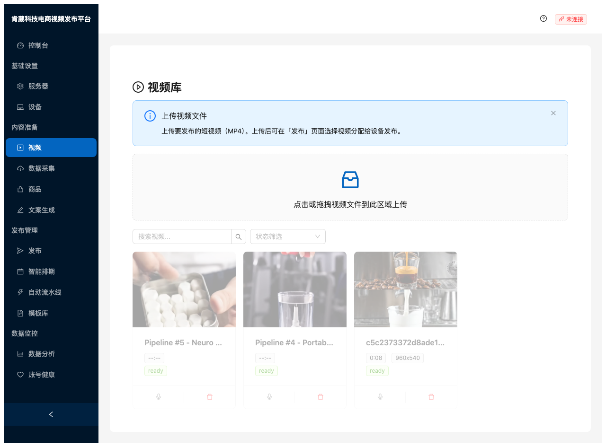

### What This Page Does

Manages the video library. Upload short videos (MP4) that will be assigned to devices during the publishing step.

### Inputs

- **Drag & drop** or click the upload area to select video files
- Supported format: **MP4**
- Multiple files can be uploaded at once

### Video Card Info

Each video card shows:
- **Thumbnail**: Auto-generated preview frame
- **Title**: File name or pipeline-generated name
- **Duration**: Video length (e.g., 0:08)
- **Resolution**: Video dimensions (e.g., 960x540)
- **Status**: `ready` (available for publishing)

### Filters

- **搜索视频** (Search): Search by video title
- **状态筛选** (Status filter): Filter by video status

> **Things to watch out for:**
> - Videos generated by the **Auto Pipeline** (自动流水线) will automatically appear here with a `Pipeline #N` prefix.
> - Large video files may take time to upload — there is no progress bar, so wait for the card to appear.
> - Videos are stored locally in `backend/data/uploads/`. Ensure sufficient disk space.
> - Currently only MP4 format is supported.

---

## 6. Step 4: Data Scraping (数据采集)

> **Sidebar**: 内容准备 → 数据采集

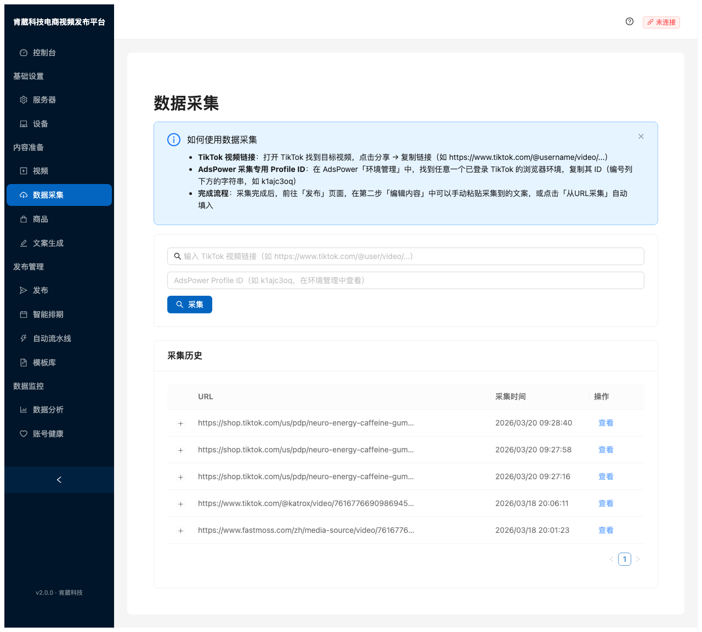

### What This Page Does

Scrapes captions, hashtags, and metadata from TikTok videos. Uses an AdsPower browser profile to access TikTok and extract content that you can then use in your own publishing.

### Inputs

| Field | Description | Example |
|-------|-------------|---------|
| **TikTok 视频链接** | URL of the TikTok video | `https://www.tiktok.com/@user/video/123...` |
| **AdsPower Profile ID** | The profile to use for scraping | `k1ac3oq` (found in AdsPower settings) |

### How to Use

1. Go to TikTok, find a video you want to scrape
2. Click Share → Copy Link
3. Paste the URL in the input field
4. Enter your AdsPower Profile ID (found in AdsPower environment management)
5. Click **采集** (Scrape)

### Outputs

The **采集历史** (Scrape History) table shows:
- URL that was scraped
- Timestamp of the scrape
- **查看** (View) link to see the scraped content

### How the Scraped Data is Used

After scraping, go to the **发布** (Publish) page. In Step 3 (编辑内容), you can click **从URL采集** to load scraped captions and tags, or manually paste them.

> **Things to watch out for:**
> - The scraping uses a **real AdsPower browser** to navigate TikTok. AdsPower must be running.
> - The specified Profile ID must exist in your AdsPower and must **not** be currently open/in-use.
> - TikTok may rate-limit or block rapid scraping. Space out your scrapes.
> - Some TikTok URLs (especially TikTok Shop product links) will scrape product metadata instead of video content.

---

## 7. Step 5: Product Management (商品)

> **Sidebar**: 内容准备 → 商品

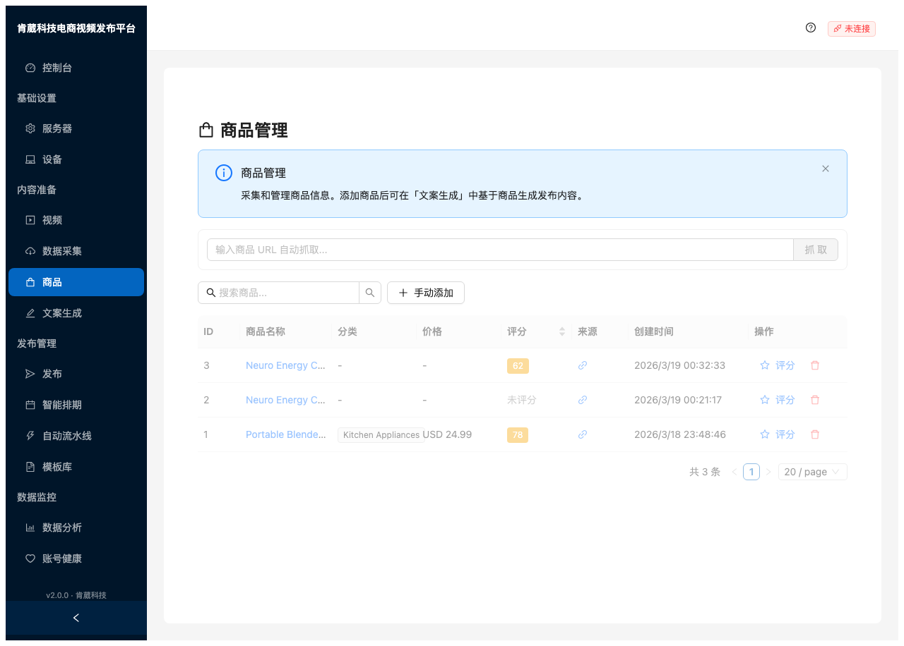

### What This Page Does

Manages product information used for AI content generation. Products can be scraped automatically from e-commerce URLs or added manually.

### Adding Products

**Method 1 — URL Scraping** (Recommended):
1. Paste a product URL (TikTok Shop, FastMoss, etc.) in the top input bar
2. Click **抓取** (Scrape)
3. The system automatically extracts: name, price, category, images, description

**Method 2 — Manual Entry**:
1. Click **手动添加** (Manual Add)
2. Fill in: name (required), category, price, currency, source URL, description
3. Click **添加** (Add)

### Product Table

| Column | Description |
|--------|-------------|
| **ID** | Auto-incremented identifier |
| **商品名称** (Product Name) | Clickable — opens detail drawer |
| **分类** (Category) | Product category tag |
| **价格** (Price) | Price with currency |
| **评分** (Score) | AI-generated viral potential score (0-100) |
| **来源** (Source) | Link icon to the original URL |
| **操作** (Actions) | Score button + delete button |

### AI Scoring

Click **评分** (Score) to have Claude AI analyze the product's viral potential:
- **Score** (0-100): Higher = better viral potential. Green (80+), Yellow (60-79), Red (<60)
- **Reasoning**: AI explains why it gave this score
- **Suggested Angles**: Marketing angles to use in content

### Detail Drawer

Click any product name to open a detail drawer showing:
- Score gauge with AI reasoning
- Basic info (category, price, source URL)
- Product description
- Suggested marketing angles
- Product images (if scraped)

> **Things to watch out for:**
> - AI scoring requires a valid **Anthropic API key** configured in `backend/.env` as `ANTHROPIC_API_KEY`.
> - Scraping requires internet access and may fail if the source website blocks automated requests.
> - Products with scores above 80 are good candidates for content generation and publishing.

---

## 8. Step 6: AI Content Generation (文案生成)

> **Sidebar**: 内容准备 → 文案生成

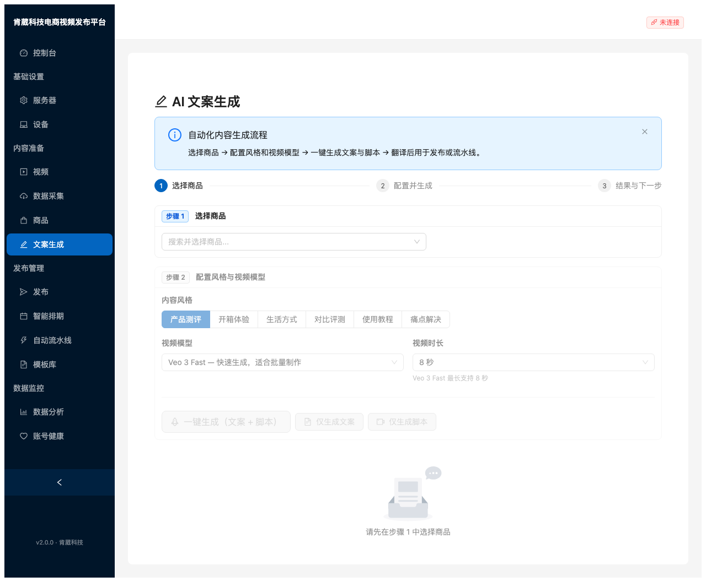

### What This Page Does

Generates marketing copy, hashtags, descriptions, and video scripts using AI (Claude), based on your product information.

### 3-Step Flow

The page follows a guided 3-step process shown at the top:

#### Step 1: Select Product (选择商品)
- Use the searchable dropdown to find and select a product
- If no products exist, click "去添加商品" to navigate to the Products page

#### Step 2: Configure & Generate (配置并生成)

**Content Style** (内容风格) — Choose one:
| Style | Chinese | Description |
|-------|---------|-------------|
| Product Review | 产品测评 | Detailed product analysis |
| Unboxing | 开箱体验 | First-look unboxing experience |
| Lifestyle | 生活方式 | Lifestyle integration content |
| Comparison | 对比评测 | Comparing with alternatives |
| Tutorial | 使用教程 | How-to usage guide |
| Problem/Solution | 痛点解决 | Solving a pain point |

**Video Model** (视频模型):
| Model | Description |
|-------|-------------|
| Veo 3 Fast | Fast generation, good for batch production |
| Veo 3 | Higher quality generation |

**Video Duration** (视频时长):
- **5 秒** or **8 秒** (Veo 3 models max out at 8 seconds)

**Action Buttons**:
- **一键生成（文案 + 脚本）**: Generates BOTH caption/tags AND video script in one click (recommended)
- **仅生成文案**: Generates only caption, hashtags, and description
- **仅生成脚本**: Generates only the video script

#### Step 3: Results & Next Steps (结果与下一步)

After generation, you'll see:
- **标题文案** (Caption): The main post caption (copyable)
- **标签** (Tags): Hashtags in blue tags
- **描述** (Description): Longer post description (copyable)
- **视频脚本** (Video Script): Hook, body, CTA structure for the video
- **翻译** (Translation): Optional — translate content into multiple languages (中文, English, Espanol, etc.)

**Next action buttons**:
- **创建自动流水线**: Jump to pipeline to auto-generate video + publish
- **手动发布**: Jump to publish wizard to manually assign and publish
- **返回列表**: Go back to see all generated content for this product

> **Things to watch out for:**
> - Requires `ANTHROPIC_API_KEY` in `.env` — content generation will fail without it.
> - Each generation creates a new content piece stored in the database. Use "已有文案" (existing content) to reuse previous generations.
> - The video duration must match the selected model's capability. Veo 3 models support max **8 seconds**.
> - Translation is optional and can be done after initial generation.
> - The "一键生成" button runs two API calls sequentially, so it takes about twice as long as individual generation.

---

## 9. Step 7: Batch Publishing (发布)

> **Sidebar**: 发布管理 → 发布

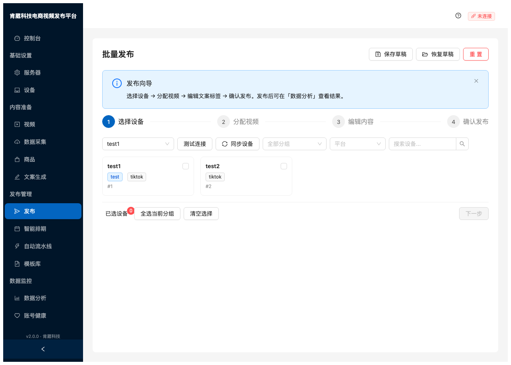

### What This Page Does

The main publishing wizard — select devices, assign videos, edit captions/tags, and publish to multiple accounts simultaneously.

### 4-Step Wizard

#### Step 1: Select Devices (选择设备)

- Select a server from the dropdown
- Click **同步设备** to refresh the device list
- Each device card shows: name, group tags, platform tags, serial number
- **Check** the devices you want to publish to
- Use **全选当前分组** (Select All in Group) for bulk selection
- Filter by group or platform using the dropdown filters
- The badge shows how many devices are selected (已选设备)

#### Step 2: Assign Videos (分配视频)

- For each selected device, assign a video
- Options: assign the same video to all, or different videos per device
- Videos come from the Video Library (视频)

#### Step 3: Edit Content (编辑内容)

- Edit the caption, hashtags, and description for each device
- **从URL采集** (From URL Scrape): Load content from a previously scraped TikTok video
- Each device can have unique or shared content

#### Step 4: Confirm & Publish (确认发布)

- Review all assignments
- Click **发布** to start publishing
- Tasks are created and executed via AdsPower browser automation

### Top Actions

- **保存草稿** (Save Draft): Save current wizard state for later
- **恢复草稿** (Restore Draft): Load a previously saved draft
- **重置** (Reset): Clear all selections and start over

> **Things to watch out for:**
> - Publishing opens **real browser windows** via AdsPower. Ensure AdsPower is running and not busy with other tasks.
> - Each publish task takes 1-3 minutes per device as it automates the browser.
> - **Do not** interact with AdsPower browsers while publishing is in progress.
> - Failed tasks can be retried from the dashboard or analytics page.
> - The connection status (top-right) must show "已连接" for real-time status updates.

---

## 10. Step 8: Smart Scheduling (智能排期)

> **Sidebar**: 发布管理 → 智能排期

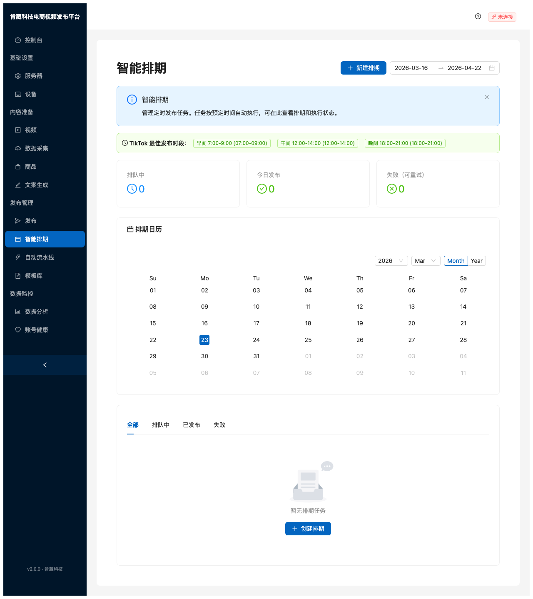

### What This Page Does

Schedule publishing tasks for optimal times. Features a visual calendar and recommended TikTok posting windows.

### Key Features

**Recommended Time Slots** (TikTok 最佳发布时段):
- Morning (早间): 7:00-9:00
- Afternoon (午间): 12:00-14:00
- Evening (晚间): 18:00-21:00

**Summary Cards**:
- **排队中** (Queued): Tasks waiting to execute
- **今日发布** (Published Today): Tasks completed today
- **失败（可重试）** (Failed, Retryable): Failed tasks that can be retried

**Calendar View** (排期日历):
- Month/Year navigation
- Today highlighted in blue
- Days with scheduled tasks show indicators
- Click a day to see its tasks

**Task Tabs**:
- **全部** (All): All scheduled tasks
- **排队中** (Queued): Pending tasks
- **已发布** (Published): Completed tasks
- **失败** (Failed): Failed tasks

### Creating a Scheduled Task

1. Click **新建排期** (New Schedule) or **创建排期** (Create Schedule)
2. Select devices, videos, and content
3. Set the scheduled date and time
4. The task will automatically execute at the scheduled time

> **Things to watch out for:**
> - The date range picker at the top-right controls which period is shown in the calendar.
> - Scheduled tasks require the **backend to be running** at the scheduled time. If the server is stopped, tasks won't execute.
> - The timezone defaults to `America/Mexico_City` — configure `DEFAULT_TIMEZONE` in `.env` to change.
> - Tasks execute via AdsPower automation, so AdsPower must also be running at the scheduled time.

---

## 11. Step 9: Auto Pipeline (自动流水线)

> **Sidebar**: 发布管理 → 自动流水线

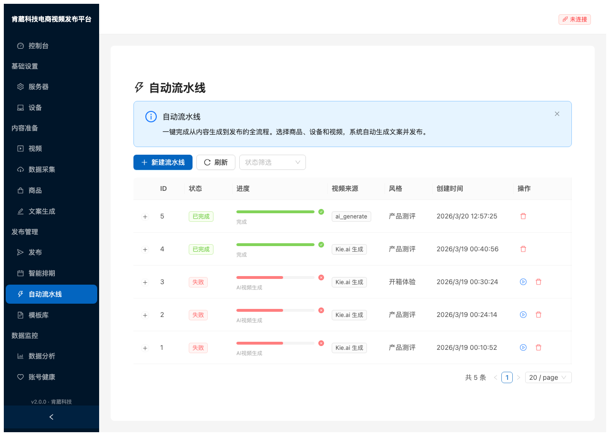

### What This Page Does

One-click automation from content generation to video creation to publishing. This is the most powerful feature — it chains together all the steps automatically.

### Pipeline Table

| Column | Description |
|--------|-------------|
| **ID** | Pipeline run ID |
| **状态** (Status) | 已完成 (completed), 失败 (failed), 运行中 (running) |
| **进度** (Progress) | Visual progress bar — green (success), red (failed) |
| **视频来源** (Video Source) | `Kie.ai 生成` (AI-generated), `ai_generate`, or `upload` |
| **风格** (Style) | Content style (产品测评, 开箱体验, etc.) |
| **创建时间** | When the pipeline was started |
| **操作** (Actions) | Resume (▶), Delete (🗑) |

### Creating a Pipeline

1. Click **新建流水线** (New Pipeline)
2. A wizard modal appears:
   - Select a product
   - Choose video source: **Kie.ai** (AI video), **MoviePy** (slideshow), or **Upload** (existing video)
   - Select target devices
   - Optionally schedule for a specific time
3. Click confirm to start

### Pipeline Stages

Depending on video source, the pipeline runs through these stages:

**Kie.ai flow** (AI video generation):
```
Content Generation → Script Generation → AI Video Generation → Subtitle Generation → Video Finalization → Publish
```

**MoviePy flow** (slideshow from images):
```
Content Generation → Script Generation → Image Generation → TTS Generation → Video Assembly → Subtitle Generation → Video Finalization → Publish
```

**Upload flow** (use existing video):
```
Content Generation → Subtitle Generation → Video Finalization → Publish
```

Click the **+** expand button on any row to see detailed stage-by-stage progress.

> **Things to watch out for:**
> - **AI Video Generation** requires `KIE_API_KEY` in `.env` — this is the kie.ai API key for Veo 3 access.
> - Video generation can take **2-5 minutes** per video. The system polls kie.ai every 10 seconds.
> - Failed pipelines can be **resumed** from the failed stage — click the ▶ button. You don't need to restart from scratch.
> - The pipeline runs in the background. You can navigate to other pages while it executes.
> - Pipeline-generated videos automatically appear in the Video Library.

---

## 12. Step 10: Template Library (模板库)

> **Sidebar**: 发布管理 → 模板库

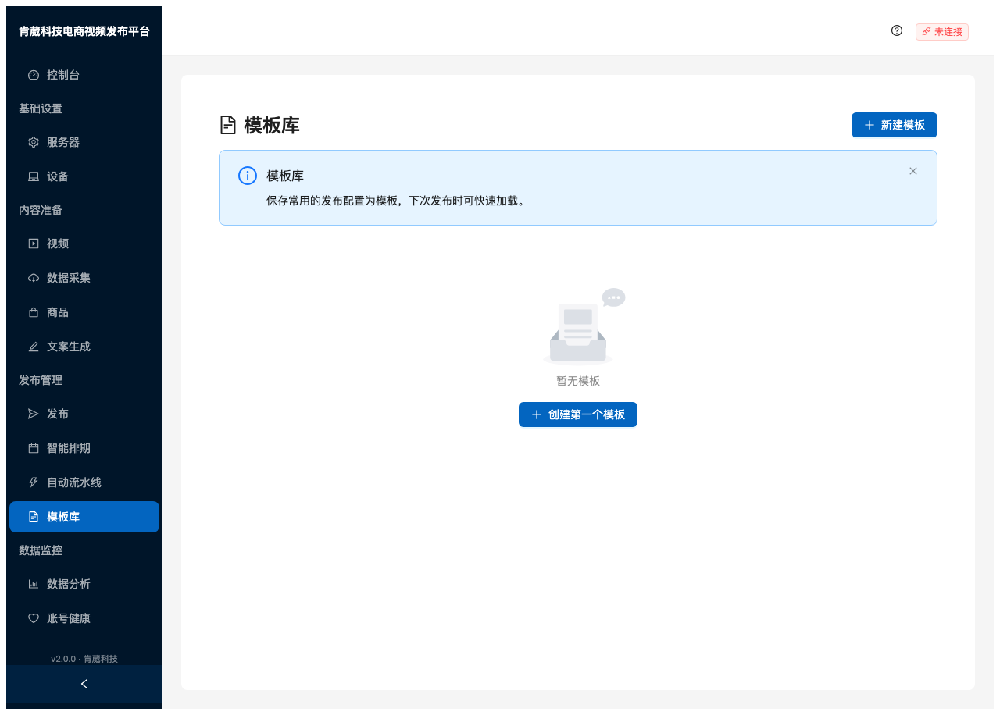

### What This Page Does

Save and reuse common publishing configurations as templates. Speeds up repetitive publishing workflows.

### Creating a Template

1. Click **新建模板** (New Template)
2. Configure:
   - Template name
   - Default caption and hashtags
   - Content style
   - Target device groups
3. Save the template

### Using a Template

When creating a new publish task or pipeline, you can load a template to pre-fill the configuration.

> **Things to watch out for:**
> - Templates save the **configuration** (style, captions, tags), not the specific videos or devices.
> - Templates are useful when you publish the same type of content repeatedly across the same device groups.

---

## 13. Step 11: Analytics (数据分析)

> **Sidebar**: 数据监控 → 数据分析

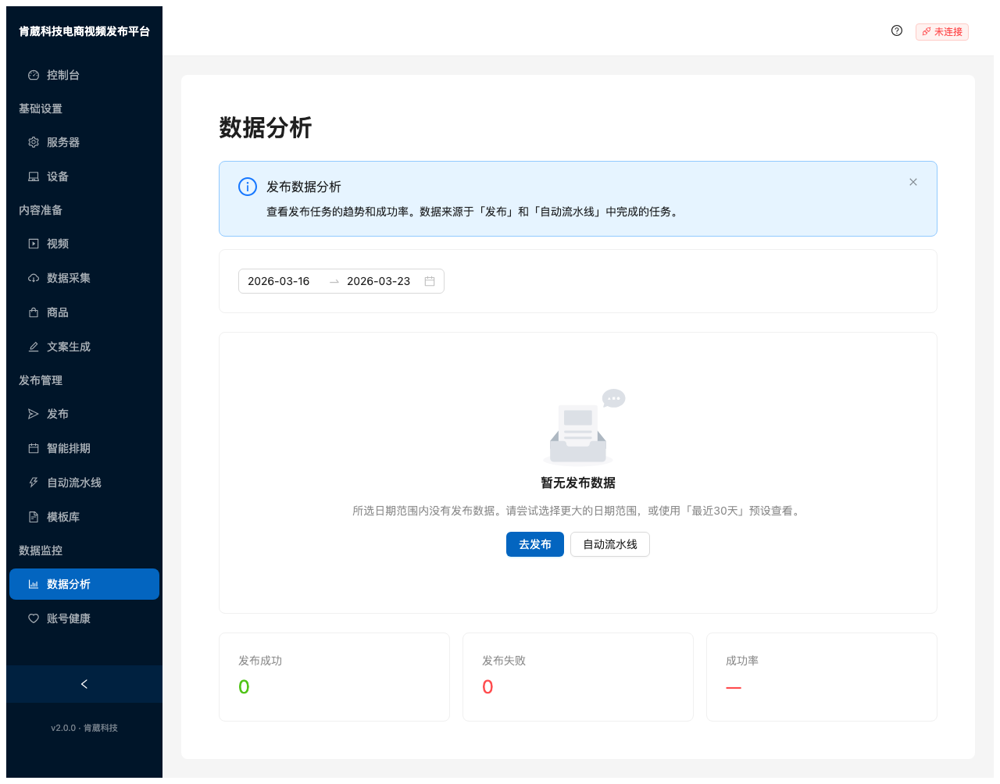

### What This Page Does

Visualizes publishing performance with charts and statistics. Shows trends over time and success/failure ratios.

### Key Elements

**Date Range Picker**: Select the period to analyze. Presets: 最近7天 (Last 7 days), 最近30天 (Last 30 days).

**Charts** (appear when data exists):
- **发布趋势** (Publishing Trend): Line chart showing daily published vs. failed counts
- **成功/失败占比** (Success/Failure Ratio): Donut/pie chart

**Summary Cards**:
| Card | Description |
|------|-------------|
| **发布成功** | Total successful publishes in the selected period |
| **发布失败** | Total failed publishes |
| **成功率** | Percentage of successful publishes |

### Empty State

When no data exists for the selected date range, the page shows a helpful message:
- If tasks are queued/running: "任务排队/执行中，完成后数据自动显示"
- If published data exists outside the range: "请尝试选择更大的日期范围"
- If no tasks exist at all: "还没有发布任务" with action buttons to navigate to Publish or Pipeline

> **Things to watch out for:**
> - Data comes from **completed** publishing tasks only (status = `published` or `failed`).
> - Tasks that are still queued or in-progress are not counted in the charts.
> - The success rate color: Green (≥80%), Red (<80%).
> - Use the "最近30天" preset to get a broader view if the 7-day view is empty.

---

## 14. Step 12: Account Health (账号健康)

> **Sidebar**: 数据监控 → 账号健康

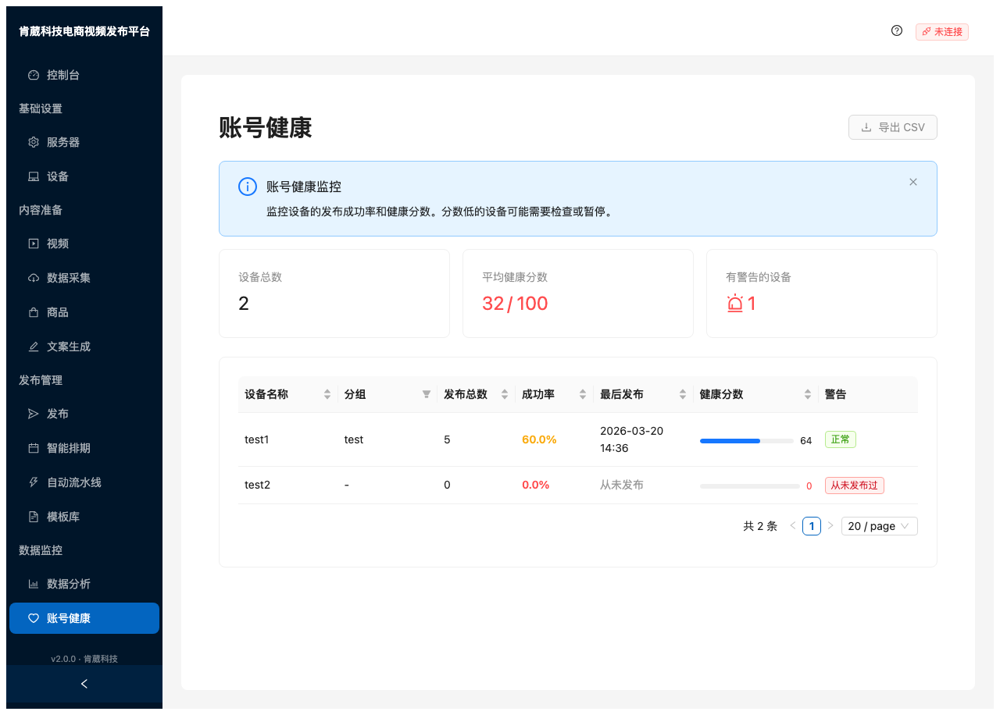

### What This Page Does

Monitors the publishing success rate and overall health of each device/account. Helps identify accounts that need attention.

### Summary Cards

| Card | Description |
|------|-------------|
| **设备总数** (Total Devices) | Number of synced devices |
| **平均健康分数** (Avg Health Score) | Average across all devices (0-100) |
| **有警告的设备** (Devices with Alerts) | Number of devices flagged with warnings |

### Health Table

| Column | Description |
|--------|-------------|
| **设备名称** (Device Name) | Profile name from AdsPower |
| **分组** (Group) | Device group, with filter dropdown |
| **发布总数** (Total Posts) | Number of publishing tasks for this device |
| **成功率** (Success Rate) | Percentage of successful publishes |
| **最后发布** (Last Published) | Timestamp of last publish, or "从未发布" (never) |
| **健康分数** (Health Score) | Visual progress bar (0-100) |
| **警告** (Alerts) | Green "正常" (normal) or red warning tags |

### Health Score Calculation

- **Success**: score ≥ 70 (green progress bar)
- **Normal**: score 40-69 (blue progress bar)
- **Exception**: score < 40 (red progress bar)

### Alerts

Common alert types:
- **从未发布过** (Never published): Device has no publishing history
- Low success rate warnings

### Export

Click **导出 CSV** (Export CSV) to download the health data as a spreadsheet.

> **Things to watch out for:**
> - Health scores update every 60 seconds automatically (auto-refresh).
> - Devices with health scores below 40 should be investigated — they may have account issues.
> - A device showing "从未发布过" is not necessarily unhealthy — it just hasn't been used yet.
> - The group filter dropdown is dynamically built from your actual device data.

---

## 15. Troubleshooting

### Common Issues

| Issue | Cause | Solution |
|-------|-------|----------|
| "未连接" (Disconnected) in header | Backend WebSocket lost | Restart backend: `uvicorn app.main:app --reload` |
| Sync devices returns empty | AdsPower not running | Start AdsPower application first |
| "Too many requests" during sync | AdsPower API rate limit | Wait 5 seconds and retry |
| Content generation fails | Missing API key | Set `ANTHROPIC_API_KEY` in `backend/.env` |
| Pipeline video generation fails | Missing kie.ai key | Set `KIE_API_KEY` in `backend/.env` |
| Publishing task stuck | AdsPower browser issue | Check if AdsPower profile is accessible, then retry the task |
| Analytics page shows empty | No completed tasks in date range | Expand the date range using "最近30天" preset |

### Environment Variables

Key settings in `backend/.env`:

```env
# Required for AI content generation
ANTHROPIC_API_KEY=sk-ant-...

# Required for AI video generation via kie.ai
KIE_API_KEY=your-kie-api-key

# Optional: OpenAI for image generation
OPENAI_API_KEY=sk-...

# AdsPower default server
ADSPOWER_BASE_URL=http://127.0.0.1:50325

# Scraper profile ID
SCRAPER_PROFILE_ID=k17avugk

# Default timezone for scheduling
DEFAULT_TIMEZONE=America/Mexico_City
```

### API Endpoints Reference

All API endpoints are at `http://localhost:8000/api/`:

| Endpoint | Description |
|----------|-------------|
| `GET /api/servers/` | List all servers |
| `POST /api/servers/{id}/sync` | Sync devices from server |
| `GET /api/profiles/` | List all devices |
| `GET /api/videos/` | List all videos |
| `POST /api/videos/upload` | Upload a video |
| `GET /api/products/` | List products |
| `POST /api/products/scrape` | Scrape product from URL |
| `POST /api/content/generate` | Generate AI content |
| `POST /api/content/generate-script` | Generate video script |
| `GET /api/tasks/` | List publishing tasks |
| `POST /api/pipeline/run` | Start a pipeline |
| `GET /api/analytics/` | Get overview statistics |
| `GET /api/analytics/timeline` | Get timeline chart data |
| `GET /api/health-dashboard/` | Get account health data |
| `GET /api/templates/` | List templates |
